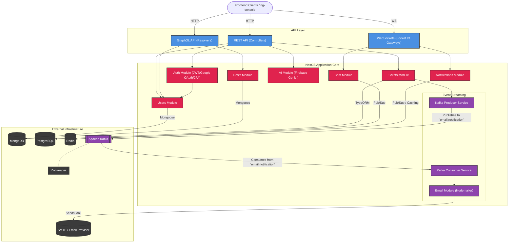

# NestJS Backend Architecture Diagram

This diagram visualizes the high-level architecture of your Cloud Console NestJS backend. It illustrates the primary modules, how they interact, and their connections to external infrastructure dependencies.

> [!NOTE]
> - **Red Nodes**: NestJS Core Modules
> - **Purple Nodes**: Kafka-driven Event Streaming & Modules
> - **Blue Nodes**: API Ingress points
> - **Dark Nodes**: External Infrastructure and Databases
