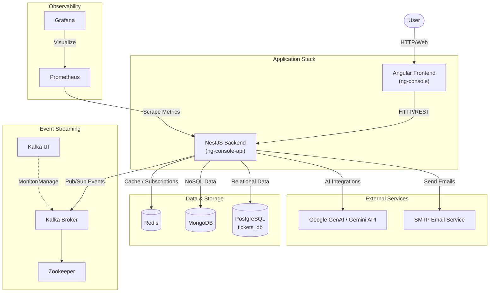

# Application Architecture

This diagram illustrates the overall system architecture, including the Angular frontend, NestJS backend API, data stores, messaging system, and observability tools.

```mermaid
flowchart TD
    User([User]) -->|HTTP/Web| Frontend["Angular Frontend<br/>(ng-console)"]
    Frontend -->|HTTP/REST| Backend["NestJS Backend<br/>(ng-console-api)"]

    subgraph ApplicationStack [Application Stack]
        Frontend
        Backend
    end

    subgraph ExternalServices [External Services]
        GenAI["Google GenAI / Gemini API"]
        SMTP["SMTP Email Service"]
    end

    Backend -->|AI Integrations| GenAI
    Backend -->|Send Emails| SMTP

    subgraph DataAndStorage [Data & Storage]
        Backend -->|Cache / Subscriptions| Redis[("Redis")]
        Backend -->|NoSQL Data| Mongo[("MongoDB")]
        Backend -->|Relational Data| Postgres[("PostgreSQL<br/>tickets_db")]
    end

    subgraph EventStreaming [Event Streaming]
        Backend -->|Pub/Sub Events| Kafka["Kafka Broker"]
        Kafka --> Zookeeper["Zookeeper"]
        KafkaUI["Kafka UI"] -.->|Monitor/Manage| Kafka
    end

    subgraph Observability
        Prometheus["Prometheus"] -->|Scrape Metrics| Backend
        Grafana["Grafana"] -->|Visualize| Prometheus
    end
```
