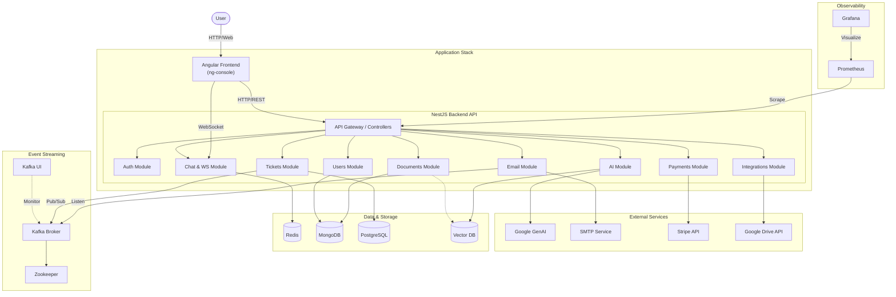

# Application Architecture

This diagram illustrates the overall system architecture, including the Angular frontend, NestJS backend API, data stores, messaging system, and observability tools, along with new features such as real-time WebSockets, Stripe Payments, Google Drive Integration, and Vector DB for RAG.

